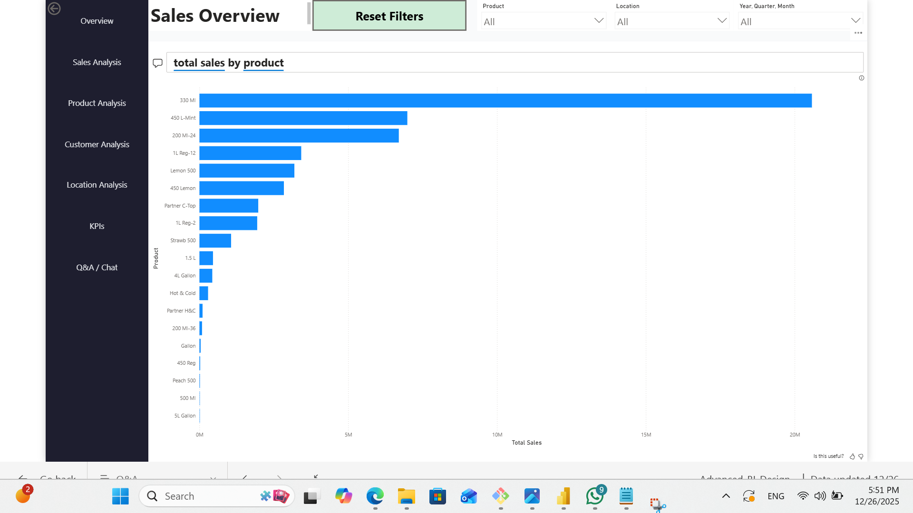

# Enterprise Sales Analytics — Power BI

## Overview
An end-to-end Power BI solution designed to monitor sales performance,
identify top and bottom products, and enable self-service analytics
using natural language queries.

## Features
- Star schema data model
- Centralized measure table
- KPI indicators (R/Y/G)
- Top & Bottom product analysis
- Drill-through diagnostics
- Reset filters button
- Power BI Q&A integration

## Tools
- Power BI Desktop
- DAX
- Power Query

## Screenshots

